# End-to-End DevOps Project: CI/CD and Monitoring for Portfolio Website


## 📋 Project Overview

This project demonstrates a complete DevOps workflow implementing CI/CD pipelines and monitoring for a static portfolio website. The architecture follows modern DevOps principles including **Automation**, **GitOps**, and **Observability** to create a robust, scalable deployment solution.

### 🎯 Key Objectives
- Implement automated CI/CD pipeline from code commit to production deployment
- Apply GitOps methodology for deployment management
- Establish comprehensive monitoring and observability
- Demonstrate industry-standard DevOps practices

```mermaid
graph TB
    %% Developer and Source Control
    DEV[👨‍💻 Developer] --> |git push| GH[📚 GitHub Repository<br/>Portfolio Website Code]
    
    %% Webhook Trigger
    GH --> |Webhook via ngrok| NGROK[🌐 ngrok Tunnel<br/>Local Exposure]
    NGROK --> |HTTP Request| JEN[🔧 Jenkins CI Server<br/>Agent Node VM]
    
    %% CI Pipeline Steps
    JEN --> |1. Clone Code| CLONE[📥 Clone Repository]
    CLONE --> |2. Build Image| BUILD[🐳 Docker Build<br/>Multi-stage Dockerfile]
    BUILD --> |3. Push Image| DH[🏪 Docker Hub Registry<br/>fatma/portfolio:v1.x]
    
    %% Manifest Update
    JEN --> |4. Update Manifests| UPDATE[📝 Update K8s Manifests<br/>New Image Tag]
    UPDATE --> |5. Git Commit| GH
    
    %% GitOps CD Pipeline
    GH --> |GitOps Sync| ARGO[🔄 ArgoCD<br/>Continuous Deployment]
    ARGO --> |Deploy| K8S[☸️ Kubernetes Cluster K3s]
    
    %% Kubernetes Components
    subgraph "Kubernetes Cluster (2 Nodes)"
        subgraph "Master Node (2 vCPU, 2GB RAM)"
            MASTER[🎯 Control Plane<br/>API Server, etcd, Scheduler]
            ARGO_POD[🔄 ArgoCD Pods<br/>GitOps Controller]
            PROM[📊 Prometheus<br/>Metrics Collection]
            GRAF[📈 Grafana<br/>Visualization Dashboard]
        end
        
        subgraph "Agent Node (1 vCPU, 1GB RAM)"
            AGENT[⚙️ Worker Node<br/>kubelet, kube-proxy]
            APP_PODS[🌐 Portfolio App Pods<br/>Nginx + Static Files]
            JEN_VM[🔧 Jenkins Server<br/>Same VM as Agent]
        end
        
        MASTER -.-> AGENT
    end
    
    %% Monitoring Flow
    APP_PODS --> |Metrics| PROM
    AGENT --> |Node Metrics| PROM
    MASTER --> |Cluster Metrics| PROM
    PROM --> |Query| GRAF
    
    %% External Access
    USERS[👥 End Users] --> |HTTP| LB[⚖️ LoadBalancer/NodePort<br/>Portfolio Website]
    LB --> APP_PODS
    
    ADMIN[👨‍💼 DevOps Admin] --> |Monitor| GRAF
    ADMIN --> |Manage| ARGO_POD
    ADMIN --> |Configure| JEN
    
    %% Styling
    classDef developer fill:#e1f5fe,stroke:#01579b,stroke-width:2px
    classDef source fill:#f3e5f5,stroke:#4a148c,stroke-width:2px
    classDef ci fill:#fff3e0,stroke:#e65100,stroke-width:2px
    classDef cd fill:#e8f5e8,stroke:#2e7d32,stroke-width:2px
    classDef k8s fill:#e3f2fd,stroke:#1565c0,stroke-width:2px
    classDef monitoring fill:#fce4ec,stroke:#ad1457,stroke-width:2px
    classDef storage fill:#f1f8e9,stroke:#33691e,stroke-width:2px
    classDef users fill:#fff8e1,stroke:#f57f17,stroke-width:2px
    
    class DEV developer
    class GH,NGROK source
    class JEN,CLONE,BUILD,UPDATE ci
    class ARGO,ARGO_POD cd
    class K8S,MASTER,AGENT,APP_PODS,LB k8s
    class PROM,GRAF monitoring
    class DH storage
    class USERS,ADMIN users
```


## 🏗️ Architecture

```
GitHub Repository → Jenkins (CI) → Docker Hub → ArgoCD (CD) → Kubernetes Cluster
                                                                      ↓
                                                            Prometheus & Grafana
                                                               (Monitoring)
```

## 🛠️ Technology Stack

| Component | Technology | Purpose |
|-----------|------------|---------|
| **Application** | Static HTML/CSS | Portfolio website |
| **Containerization** | Docker & Docker Hub | Application packaging and registry |
| **Orchestration** | K3s (Lightweight Kubernetes) | Container orchestration |
| **CI Pipeline** | Jenkins | Continuous Integration |
| **CD Pipeline** | ArgoCD | GitOps-based Continuous Deployment |
| **Monitoring** | Prometheus & Grafana | Metrics collection and visualization |
| **Automation** | GitHub Webhooks + ngrok | Automated pipeline triggers |

## 🚀 Features

- ✅ **Automated CI/CD Pipeline**: Code changes trigger automatic build, test, and deployment
- ✅ **GitOps Workflow**: Git repository as single source of truth
- ✅ **Multi-stage Docker Build**: Optimized containerization with Nginx
- ✅ **Kubernetes Deployment**: Scalable container orchestration
- ✅ **Real-time Monitoring**: Comprehensive metrics and alerting
- ✅ **Webhook Integration**: Automated pipeline triggers
- ✅ **Infrastructure as Code**: All configurations version-controlled

## 📁 Project Structure

```
project-root/
├── Dockerfile                 # Multi-stage Docker build
├── Jenkinsfile               # Pipeline configuration
├── k8s/                      # Kubernetes manifests
│   ├── deployment.yaml       # Application deployment
│   └── service.yaml          # Service configuration
├── vars/                     # Jenkins shared library
│   └── buildAndDeploy.groovy # CI pipeline logic
├── src/                      # Application source code
│   ├── index.html
│   └── styles.css
└── README.md
```

## 🔧 Setup Instructions

### Prerequisites

- 2 CentOS VMs (VMware or similar virtualization platform)
  - **Master Node**: 2 vCPU, 2GB RAM
  - **Agent Node**: 1 vCPU, 1GB RAM
- Docker Hub account
- GitHub repository
- Basic knowledge of Kubernetes, Docker, and CI/CD concepts

### Phase 1: Environment Setup

#### 1.1 Kubernetes Cluster (K3s)

**Master Node Setup:**
```bash
# Install K3s server
curl -sfL https://get.k3s.io | sh -s - --write-kubeconfig-mode 644

# Verify installation
sudo k3s kubectl get nodes
```

**Agent Node Setup:**
```bash
# Get token from master node
sudo cat /var/lib/rancher/k3s/server/node-token

# Join agent to cluster
curl -sfL https://get.k3s.io | K3S_URL=https://<MASTER_IP>:6443 K3S_TOKEN=<YOUR_TOKEN> sh -
```

#### 1.2 Application Containerization

Create a `Dockerfile` for the static website:
```dockerfile
# Multi-stage build example
FROM nginx:alpine
COPY src/ /usr/share/nginx/html/
EXPOSE 80
CMD ["nginx", "-g", "daemon off;"]
```

### Phase 2: Jenkins CI Pipeline

#### 2.1 Jenkins Installation (Agent Node)

```bash
# Install dependencies
sudo yum update -y
sudo yum install -y java-11-openjdk git docker

# Install Jenkins
sudo wget -O /etc/yum.repos.d/jenkins.repo https://pkg.jenkins.io/redhat-stable/jenkins.repo
sudo rpm --import https://pkg.jenkins.io/redhat-stable/jenkins.io.key
sudo yum install -y jenkins

# Start services
sudo systemctl start jenkins docker
sudo systemctl enable jenkins docker

# Add jenkins user to docker group
sudo usermod -aG docker jenkins
```

#### 2.2 Jenkins Configuration

1. Access Jenkins at `http://<agent-node-ip>:8080`
2. Install required plugins: Docker Pipeline, GitHub Integration
3. Configure credentials:
   - Docker Hub credentials
   - GitHub Personal Access Token

#### 2.3 Pipeline Setup

Create a Jenkins Pipeline job pointing to your GitHub repository with the provided `Jenkinsfile`.

### Phase 3: ArgoCD GitOps Deployment

#### 3.1 ArgoCD Installation

```bash
# Create namespace and install ArgoCD
kubectl create namespace argocd
kubectl apply -n argocd -f https://raw.githubusercontent.com/argoproj/argo-cd/stable/manifests/install.yaml

# Expose ArgoCD UI
kubectl patch svc argocd-server -n argocd -p '{"spec": {"type": "NodePort"}}'

# Get initial admin password
kubectl get secret argocd-initial-admin-secret -n argocd -o jsonpath="{.data.password}" | base64 -d
```

#### 3.2 Create ArgoCD Application

Apply the ArgoCD Application manifest to deploy your portfolio website.

### Phase 4: Monitoring Setup

#### 4.1 Prometheus & Grafana Installation

```bash
# Install Helm
curl https://get.helm.sh/helm-v3.12.0-linux-amd64.tar.gz | tar xz
sudo mv linux-amd64/helm /usr/local/bin/

# Add Prometheus Helm repository
helm repo add prometheus-community https://prometheus-community.github.io/helm-charts
helm repo update

# Install monitoring stack
kubectl create namespace monitoring
helm install prometheus prometheus-community/kube-prometheus-stack -n monitoring
```

#### 4.2 Access Grafana

```bash
# Expose Grafana
kubectl patch svc prometheus-grafana -n monitoring -p '{"spec": {"type": "NodePort"}}'

# Get Grafana admin password
kubectl get secret prometheus-grafana -n monitoring -o jsonpath="{.data.admin-password}" | base64 -d
```

### Phase 5: Webhook Automation

#### 5.1 Setup ngrok (for local development)

```bash
# Download and install ngrok
wget https://bin.equinox.io/c/4VmDzA7iaHb/ngrok-stable-linux-amd64.zip
unzip ngrok-stable-linux-amd64.zip
sudo mv ngrok /usr/local/bin/

# Expose Jenkins
./ngrok http 8080
```

#### 5.2 Configure GitHub Webhook

1. Go to your GitHub repository settings
2. Add webhook with ngrok URL: `<ngrok_url>/github-webhook/`
3. Select "push" events only
4. Set content type to `application/json`

## 🔄 Workflow

1. **Developer pushes code** to GitHub repository
2. **GitHub webhook triggers** Jenkins pipeline automatically
3. **Jenkins pipeline**:
   - Clones repository
   - Builds Docker image
   - Pushes to Docker Hub
   - Updates Kubernetes manifests with new image tag
   - Commits changes back to repository
4. **ArgoCD detects** manifest changes and syncs
5. **New version deploys** to Kubernetes cluster
6. **Prometheus & Grafana** provide monitoring and alerting

## 📊 Monitoring & Observability

- **Prometheus**: Metrics collection from Kubernetes cluster
- **Grafana**: Visualization dashboards and alerting
- **Pre-configured dashboards** for Kubernetes cluster monitoring
- **Real-time metrics** for application and infrastructure health

## 🔍 Accessing Services

| Service | URL | Default Credentials |
|---------|-----|-------------------|
| Jenkins | `http://<agent-node-ip>:8080` | admin / (check initial setup) |
| ArgoCD | `http://<master-node-ip>:<nodeport>` | admin / (kubectl get secret) |
| Grafana | `http://<master-node-ip>:<nodeport>` | admin / (kubectl get secret) |
| Application | `http://<cluster-ip>:<nodeport>` | - |

## 🛡️ Security Considerations

- Use secrets management for sensitive data
- Implement RBAC for Kubernetes and ArgoCD
- Regular security updates for all components
- Network policies for cluster isolation
- Secure webhook endpoints

## 🔧 Troubleshooting

### Common Issues

1. **Jenkins can't connect to Docker**
   - Ensure jenkins user is in docker group
   - Restart Jenkins service

2. **ArgoCD sync issues**
   - Check repository credentials
   - Verify manifest syntax

3. **Webhook not triggering**
   - Verify ngrok tunnel is active
   - Check Jenkins webhook configuration

## 📝 Future Enhancements

- [ ] Implement automated testing in CI pipeline
- [ ] Add security scanning (vulnerability assessment)
- [ ] Implement blue-green or canary deployment strategies
- [ ] Add automatic rollback mechanisms
- [ ] Integrate with external secret management (HashiCorp Vault)
- [ ] Implement multi-environment deployments (dev, staging, prod)

## 🤝 Contributing

1. Fork the repository
2. Create a feature branch
3. Make your changes
4. Test thoroughly
5. Submit a pull request

## 📄 License

This project is licensed under the MIT License - see the [LICENSE](LICENSE) file for details.

## 👨‍💻 Author

**Fatma Ahmed Abd El-Fadeel**  
ITI - Information Technology Institute  

## 📧 Contact

For questions or support, please open an issue in the GitHub repository.

---

**⭐ If this project helped you, please give it a star!**
